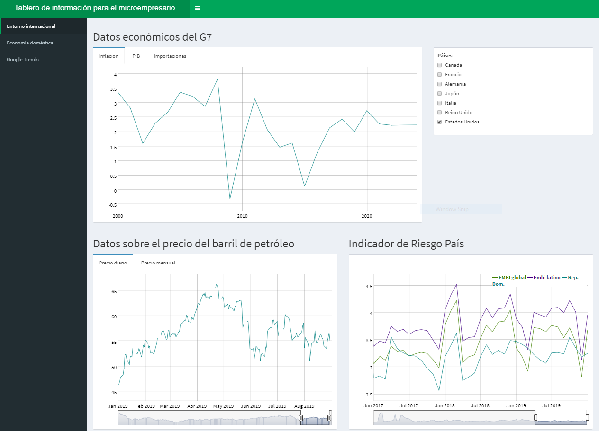
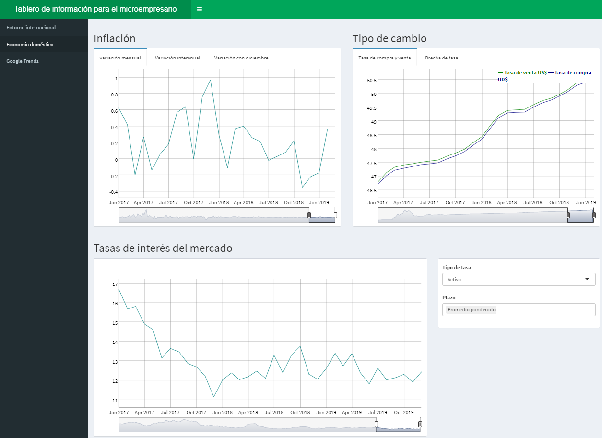
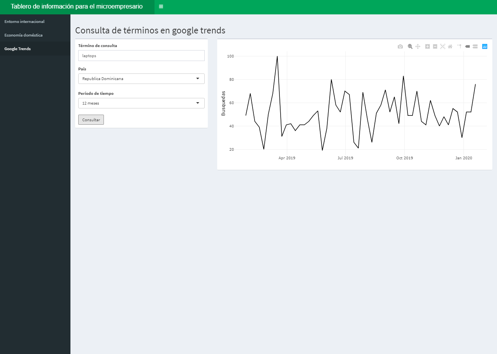

---
output:
  html_document: default
  pdf_document: default
---

# Descripción general: Tablero de información para el microempresario

El tablero de información para el microempresario es un aplicación web que contienen el resumen de una serie de variables macroeconómicas útiles para la toma de decisiones de las empresas. En general, brinda un panorama de la situación coyuntural tanto de los mercados internacionales como de la economía local. 

## Estructura de la aplicación

### Entorno internacional

El entrono internacional contiene los resultados de las principales variables macroeconómicas de las economías avanzadas y sus proyecciones. Entre las variables disponibles se encuentran la inflación, la tasa de crecimiento del PIB y las importaciones totales por país. En este caso se permite al usuario seleccionar el país de interés y comparar los resultados con los de otras economías.

Además, en esta sección de la aplicación se presentan las tendencias de los precios del petróleo y el indicador riesgo país (EMBI).

### Entorno doméstico

Esta sección de la aplicación contiene información de variables locales. Se puede explorar la la evolución de la inflación y del tipo de cambio. Por otro lado se incluyen datos sobre las tasas activas y pasivas del mercado financiero que podría servir para las sediciones de inversión de las empresas. 

### Google trends

La consulta de google trends perite a los usuarios visualizar un índice en el que se resume la frecuencia de búsqueda de términos en el tiempo. Simplemente se escribe el términos a consultar y se tendrá la evolución más reciente  de búsquedas en las aplicaciones de google.

